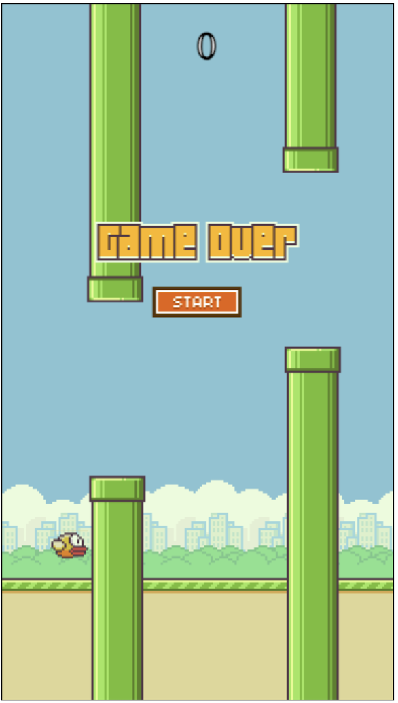
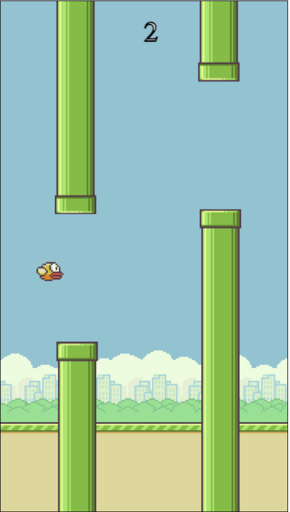

Flappy Bird: This codebase is an attempt at cloning 'Flappy Bird', a mobile game from 2013 where players control a bird by tapping the screen to navigate it through gaps between green pipes. The goal is to avoid touching the pipes, and the game gained popularity for its simplicity and challenging difficulty. Despite its success, the creator later removed it from app stores due to concerns about its addictive nature.

Technologies used included; JavaScript, HTML, CSS

Getting Started:

-   Use the space key to move the bird
-   Click the following link to start playing -->

Next Steps:

-   Improve the movement logic (physics, etc.)
-   Implement different bird animation (i.e. tilt)
-   Implement game sounds and music
-   Implement score keeping and medal achievements
